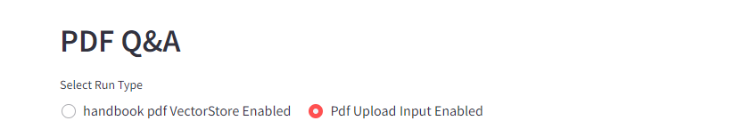
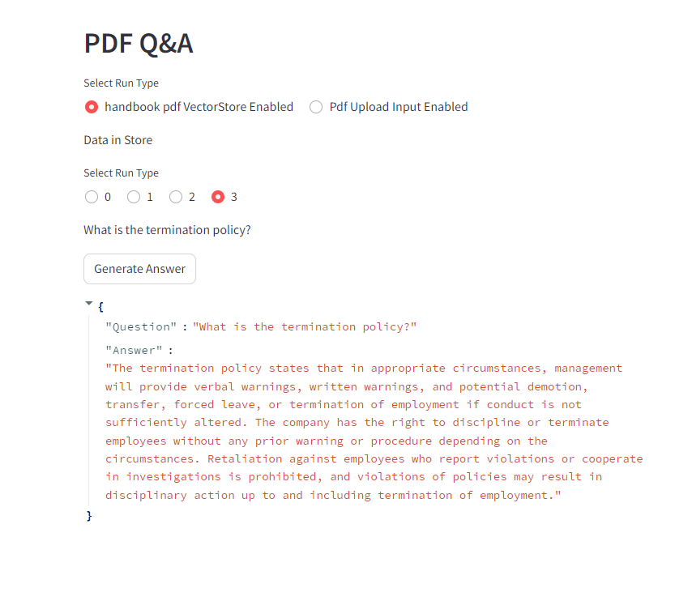
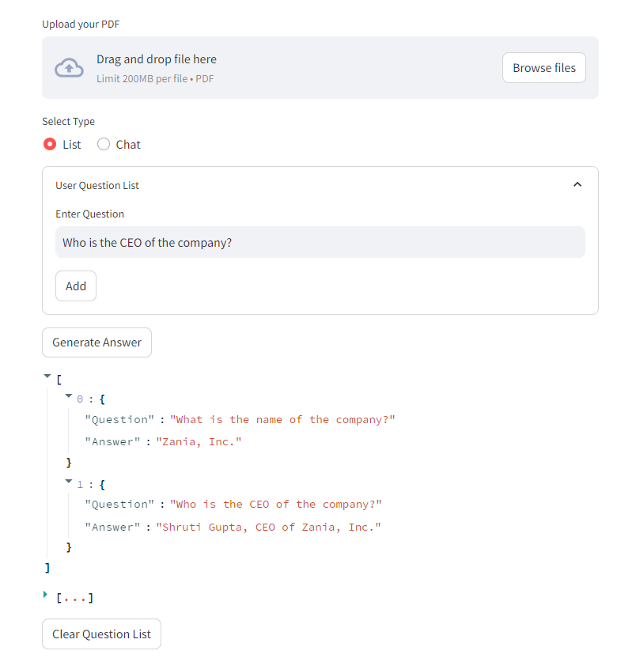

## **PDF ChatBot With OpenAI**

#### Python Version: 3.10

### **How to Run project**
- Go to your project DIR
- Make venv: python -m venv "envname"
- activate that venv 
- run requirements: Python -m pip install -r requirements.txt
- run app.py: streamlit run app.py

#### Improvement
- PDF text preprocessing for cleaning. 
- Build knowledge graph over pdf section.
- Use of RAG Agent.

#### Saved vector embedding for pdf

#### upload pdf and question list

